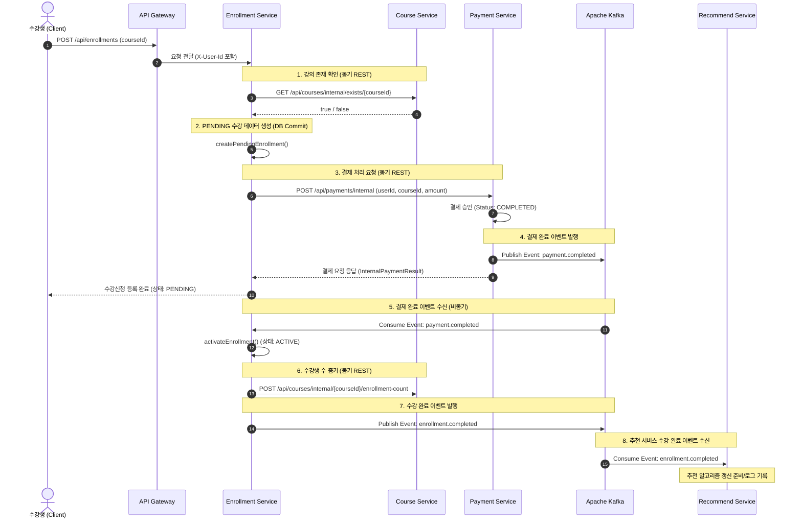
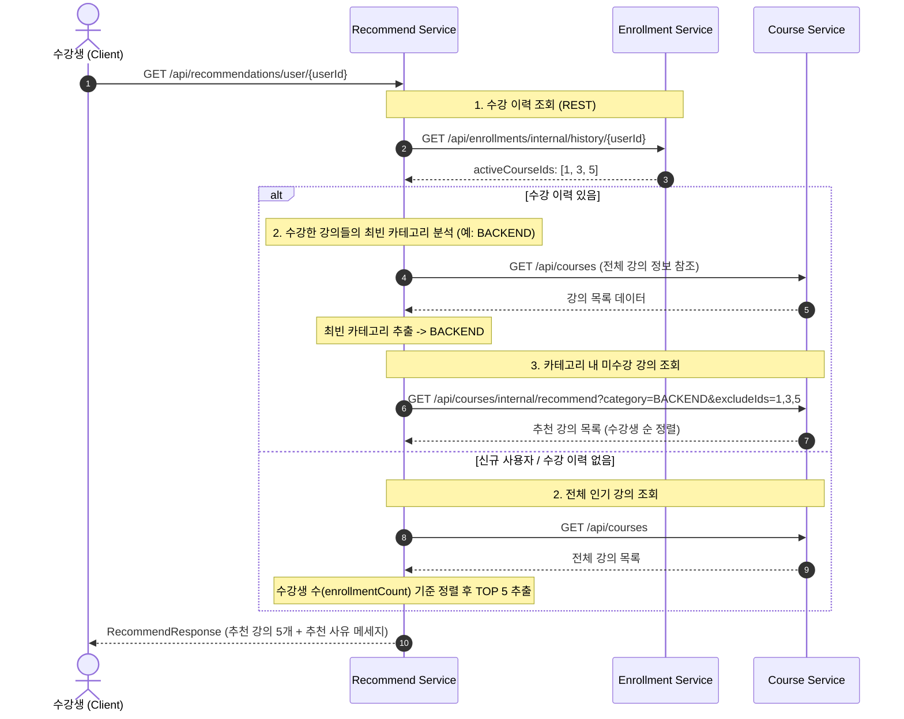

# 온라인 강의 플랫폼 (MSA Architecture) 프로젝트 종합 정리 문서

본 문서는 온라인 강의 및 수강 신청 플랫폼 프로젝트의 **전체 아키텍처, 서비스별 기능, 데이터 흐름, 연동 방식, 데이터베이스 스키마**를 상세히 정하여 기술한 문서입니다.

---

## 1. 프로젝트 개요

본 프로젝트는 **Spring Cloud**, **FastAPI (Python)**, **Vue.js 3**, **MariaDB**, **Apache Kafka**를 활용하여 구축된 **마이크로서비스 아키텍처(MSA) 기반의 온라인 강의 플랫폼**입니다.

- **Service Discovery & API Gateway**: 마이크로서비스 동적 등록 및 통합 인증/라우팅
- **OAuth2 / JWT 기반 보안**: Auth Server 기반인증 및 API Gateway 단에서의 JWT 검증
- **혼합 통신 구조**:
  - **동기 통신 (REST / WebClient)**: 수강신청 전 강의 검증, 내 수강목록 응답 데이터 조합(Enrichment), 추천 서비스의 정보 조회 등
  - **비동기 이벤트 기반 통신 (Kafka)**: 결제 완료(`payment.completed`), 수강 활성화 완료(`enrollment.completed`) 이벤트 발행 및 수신

---

## 2. 전체 시스템 아키텍처 및 서비스 구성

### 2.1 아키텍처 구성도

```mermaid
flowchart TB
    subgraph Client ["Client Layer"]
        VueApp["Vue 3 Frontend (Port 3000)"]
    end

    subgraph Infrastructure ["Infrastructure Layer"]
        Eureka["Eureka Server (Service Discovery) (Port 8761)"]
        Kafka["Apache Kafka (Event Broker) (Port 9092)"]
        DB[(MariaDB - lecture_db) (Port 3379)]
    end

    subgraph Security ["Security & Gateway Layer"]
        AuthServer["Auth Server (OAuth2 / JWT) (Port 9000)"]
        Gateway["API Gateway (Port 8080)"]
    end

    subgraph Backend ["Microservices Layer"]
        UserService["User Service (Port 8081)"]
        CourseService["Course Service (Port 8082)"]
        EnrollmentService["Enrollment Service (Port 8083)"]
        PaymentService["Payment Service (Port 8084)"]
        RecommendService["Recommend Service (FastAPI) (Port 8085)"]
    end

    VueApp --> Gateway
    Gateway --> AuthServer
    Gateway --> UserService
    Gateway --> CourseService
    Gateway --> EnrollmentService
    Gateway --> PaymentService
    Gateway --> RecommendService

    UserService -. Eureka 등록 .- Eureka
    CourseService -. Eureka 등록 .- Eureka
    EnrollmentService -. Eureka 등록 .- Eureka
    PaymentService -. Eureka 등록 .- Eureka
    RecommendService -. Eureka 등록 .- Eureka

    UserService --> DB
    CourseService --> DB
    EnrollmentService --> DB
    PaymentService --> DB

    EnrollmentService -- REST (WebClient) --> CourseService
    EnrollmentService -- REST (WebClient) --> PaymentService
    RecommendService -- REST (httpx) --> EnrollmentService
    RecommendService -- REST (httpx) --> CourseService

    PaymentService -- Event (payment.completed) --> Kafka
    Kafka -- Event Consumer --> EnrollmentService
    EnrollmentService -- Event (enrollment.completed) --> Kafka
    Kafka -- Event Consumer --> RecommendService
```

### 2.2 서비스 포트 및 역할 요약

| 서비스명 | 기술 스택 | 포트 | 주요 역할 |
|---|---|---|---|
| **vue-frontend** | Vue 3, Vite, Pinia, Vue Router | 3000 | 사용자 및 강사용 Web UI (강의 조회, 수강신청, 강의 생성, AI 추천) |
| **eureka-server** | Spring Cloud Netflix Eureka | 8761 | 서비스 디스커버리 (모든 백엔드 서비스의 동적 IP/포트 관리) |
| **auth-server** | Spring Boot, Spring Security OAuth2 | 9000 | OAuth2 Authorization Server (사용자 인증 및 JWT 발급, JWK 제공) |
| **api-gateway** | Spring Cloud Gateway | 8080 | 단일 진입점(API Gateway), JWT 검증, HTTP Header 전달 (`X-User-Id` 등) |
| **user-service** | Spring Boot, Spring Data JPA | 8081 | 회원가입, 회원 정보 조회, BCrypt 비밀번호 암호화 |
| **course-service** | Spring Boot, Spring Data JPA | 8082 | 강의 개설(강사), 강의 목록/상세/카테고리 조회, 수강생 수 증가, 추천용 미수강 강의 조회 |
| **enrollment-service** | Spring Boot, Spring Data JPA, Kafka | 8083 | 수강 신청 (PENDING), 수강 활성화 (ACTIVE), 수강 이력 조회, Kafka 이벤트 발행/수신 |
| **payment-service** | Spring Boot, Spring Data JPA, Kafka | 8084 | 결제 승인 처리 (COMPLETED), 트랜잭션 ID 발급, `payment.completed` 이벤트 발행 |
| **recommend-service** | Python 3.11, FastAPI, Kafka | 8085 | 규칙/카테고리 기반 개인화 강의 추천 (수강 이력 최빈 카테고리 분석 또는 인기순) |
| **mariadb** | MariaDB 11.2 | 3379 (내부 3306) | RDBMS (`users`, `courses`, `enrollments`, `payments` 테이블 저장) |
| **kafka** | Confluent Kafka 7.7.0 | 9092 | 비동기 이벤트 메시지 브로커 |

---

## 3. 서비스별 상세 기능 및 구현 구조

### 3.1 User Service (`user-service`)
- **주요 기능**:
  - `POST /api/users/register`: 신규 회원가입 (비밀번호 `BCryptPasswordEncoder` 암호화).
  - `GET /api/users/{id}`: 사용자 ID로 회원 정보 조회.
  - `GET /api/users/me`: 로그인한 본인 정보 조회 (`X-User-Id` 헤더 활용).
  - `GET /api/users/internal/{id}`: 서비스 간 내부 호출 전용 회원 정보 조회.
- **데이터베이스**: `users` 테이블 관리.

### 3.2 Course Service (`course-service`)
- **주요 기능**:
  - `POST /api/courses`: 강의 개설 (강사 권한 `INSTRUCTOR` 확인, `X-User-Id`를 강사 ID로 설정).
  - `GET /api/courses`: 전체 강의 목록 조회.
  - `GET /api/courses/{id}`: 강의 상세 정보 조회.
  - `GET /api/courses/category/{category}`: 특정 카테고리(BACKEND, FRONTEND, DEVOPS 등) 강의 목록 조회.
  - `GET /api/courses/internal/exists/{id}`: 수강신청 전 강의 존재 여부 체크 (내부 호출).
  - `POST /api/courses/internal/{id}/enrollment-count`: 수강 완료 시 해당 강의 수강생 수(`enrollment_count`) +1 증가.
  - `GET /api/courses/internal/recommend`: 추천 서비스를 위한 카테고리별 미수강 강의 조회 (수강생 수 내림차순 정렬).
- **데이터베이스**: `courses` 테이블 관리.

### 3.3 Enrollment Service (`enrollment-service`)
- **주요 기능**:
  - `POST /api/enrollments`: 수강 신청 요청.
    1) `CourseServiceClient`로 강의 존재 확인.
    2) 중복 수강 여부 검증 (`existsByUserIdAndCourseId`).
    3) 수강 상태 `PENDING`으로 DB 저장 (`EnrollmentWriteService`).
    4) `PaymentServiceClient` (WebClient REST)로 결제 서비스에 결제 요청.
  - `KafkaListener (handlePaymentCompleted)`:
    - Kafka `payment.completed` 이벤트 수신.
    - 수강 상태 `PENDING` -> `ACTIVE`로 변경.
    - `CourseServiceClient` 호출하여 강의 수강생 수 +1 증가.
    - `EnrollmentKafkaProducer`로 `enrollment.completed` 이벤트 발행.
  - `GET /api/enrollments/me`: 내 수강 목록 조회 (Course Service REST 호출로 강의 상세 정보를 조합하여 반환).
  - `GET /api/enrollments/internal/history/{userId}`: 추천 서비스용 사용자의 활성화된(`ACTIVE`) 수강 강의 ID 목록 반환.

### 3.4 Payment Service (`payment-service`)
- **주요 기능**:
  - `POST /api/payments/internal`: 수강 신청 프로세스 중 내부 결제 승인 요청.
    - `Payment` 엔티티 생성 (`PENDING`).
    - 고유 거래 ID (`UUID.randomUUID()`) 생성 후 상태를 `COMPLETED`로 전환.
    - `PaymentKafkaProducer`를 통해 `payment.completed` 카프카 메시지 발행 (Payload: `paymentId`, `userId`, `courseId`, `status`).
  - `GET /api/payments/{id}` 및 `GET /api/payments/user/{userId}`: 결제 이력 조회.

### 3.5 Recommend Service (`recommend-service` - Python FastAPI)
- **주요 기능**:
  - `GET /api/recommendations/user/{user_id}`: 규칙 기반 개인화 강의 추천 API.
    - **알고리즘 흐름**:
      1) `EnrollmentClient`로 사용자의 기존 수강 이력(`activeCourseIds`) 조회.
      2) 수강 이력이 없는 신규 사용자인 경우: 전체 강의 중 수강생 수 기준 **인기 강의 TOP 5** 추천.
      3) 수강 이력이 있는 경우: 수강한 강의들의 카테고리를 분석하여 가장 비중이 높은 **최빈 카테고리(Dominant Category)** 추출.
      4) `CourseClient`로 해당 카테고리 내에서 이미 수강한 강의를 제외한 **미수강 추천 강의 TOP 5** 반환.
  - `Kafka Consumer (enrollment.completed)`:
    - 수강 완료 이벤트를 실시간 비동기 감지하여 추천 서비스 로그 기록 및 캐시/알고리즘 갱신 기반 제공.
  - `Eureka Client`: 애플리케이션 기동 시 Eureka Server에 `recommend-service`로 자동 등록.

### 3.6 Vue 3 Frontend (`vue-frontend`)
- **구성 요소**:
  - **인증 관리 (`store/auth.js`)**: OAuth2 PKCE 흐름 지원, 토큰/사용자 정보 Pinia 저장소 관리.
  - **강의 목록/상세 View (`CourseListView.vue`, `CourseDetailView.vue`)**: 강의 카테고리 필터링, 상세 정보 및 강사 정보 표시.
  - **수강신청 & 결제 View (`EnrollmentView.vue`)**: 원클릭 수강 신청 및 비동기 결제/활성화 상태 반영.
  - **마이페이지 View (`MyPageView.vue`)**: 내가 수강 중인 강의 목록 및 AI 개인화 추천 강의 카드 표시.
  - **강의 등록 View (`CourseCreateView.vue`)**: 강사 권한 계정의 신규 강의 생성 기능.

---

## 4. 핵심 데이터 흐름 및 이벤트 연동 시나리오

### 4.1 수강 신청 및 비동기 결제/활성화 프로세스 (Saga / Event-Driven Workflow)

다음 흐름도는 수강 신청 시 동기 REST 호출과 비동기 Kafka 이벤트가 어떻게 결합되어 일관성을 유지하는지 보여줍니다.



### 4.2 개인화 강의 추천 프로세스



---

## 5. 데이터베이스 스키마 (`lecture_db`)

`init-db/01_init.sql` 파일에 정의된 데이터베이스 테이블 구조는 다음과 같습니다.

### 5.1 `users` 테이블 (사용자 정보)
| 컬럼명 | 데이터 타입 | 제약 조건 | 설명 |
|---|---|---|---|
| `id` | BIGINT | PRIMARY KEY, AUTO_INCREMENT | 사용자 고유 식별자 |
| `email` | VARCHAR(255) | NOT NULL, UNIQUE | 사용자 이메일 (계정 아이디) |
| `password` | VARCHAR(255) | NOT NULL | BCrypt 암호화된 비밀번호 |
| `name` | VARCHAR(100) | NOT NULL | 사용자 이름 |
| `role` | VARCHAR(20) | NOT NULL | 사용자 권한 (`STUDENT` 또는 `INSTRUCTOR`) |
| `created_at` | DATETIME(6) | | 생성 일시 |
| `updated_at` | DATETIME(6) | | 수정 일시 |

### 5.2 `courses` 테이블 (강의 정보)
| 컬럼명 | 데이터 타입 | 제약 조건 | 설명 |
|---|---|---|---|
| `id` | BIGINT | PRIMARY KEY, AUTO_INCREMENT | 강의 고유 식별자 |
| `title` | VARCHAR(255) | NOT NULL | 강의 제목 |
| `description` | TEXT | | 강의 설명 |
| `category` | VARCHAR(50) | NOT NULL | 카테고리 (`BACKEND`, `FRONTEND`, `DEVOPS`, `DATA_SCIENCE` 등) |
| `price` | DECIMAL(10,2) | NOT NULL | 강의 가격 |
| `instructor_id` | BIGINT | NOT NULL, FK (users.id) | 개설 강사 ID |
| `enrollment_count` | INT | NOT NULL, DEFAULT 0 | 현재 수강생 수 |
| `status` | VARCHAR(20) | NOT NULL, DEFAULT 'ACTIVE' | 강의 상태 (`ACTIVE`, `INACTIVE`) |
| `created_at` | DATETIME(6) | | 생성 일시 |
| `updated_at` | DATETIME(6) | | 수정 일시 |

### 5.3 `enrollments` 테이블 (수강 신청 정보)
| 컬럼명 | 데이터 타입 | 제약 조건 | 설명 |
|---|---|---|---|
| `id` | BIGINT | PRIMARY KEY, AUTO_INCREMENT | 수강신청 고유 식별자 |
| `user_id` | BIGINT | NOT NULL, FK (users.id) | 수강생 ID |
| `course_id` | BIGINT | NOT NULL, FK (courses.id) | 신청 강의 ID |
| `status` | VARCHAR(20) | NOT NULL, DEFAULT 'PENDING' | 수강 상태 (`PENDING`, `ACTIVE`, `CANCELLED`) |
| `created_at` | DATETIME(6) | | 생성 일시 |
| `updated_at` | DATETIME(6) | | 수정 일시 |
| **복합 유니크** | `uq_user_course` | UNIQUE (`user_id`, `course_id`) | 동일 강의 중복 신청 방지 |

### 5.4 `payments` 테이블 (결제 내역 정보)
| 컬럼명 | 데이터 타입 | 제약 조건 | 설명 |
|---|---|---|---|
| `id` | BIGINT | PRIMARY KEY, AUTO_INCREMENT | 결제 고유 식별자 |
| `user_id` | BIGINT | NOT NULL, FK (users.id) | 결제자 ID |
| `course_id` | BIGINT | NOT NULL, FK (courses.id) | 결제 대상 강의 ID |
| `amount` | DECIMAL(10,2) | NOT NULL | 결제 금액 |
| `status` | VARCHAR(20) | NOT NULL, DEFAULT 'PENDING' | 결제 상태 (`PENDING`, `COMPLETED`, `FAILED`, `CANCELLED`) |
| `transaction_id` | VARCHAR(255) | UNIQUE | 외부/시스템 승인 고유 거래 ID |
| `created_at` | DATETIME(6) | | 생성 일시 |
| `updated_at` | DATETIME(6) | | 수정 일시 |

---

## 6. 빌드 및 실행 가이드

### 6.1 인프라 사전 구동 및 이미지 로드
```bash
# 1. 공통 인프라 Docker 이미지 파일 로드 (Auth Server 및 Gateway)
docker load -i infra-images.tar

# 2. Docker Compose 빌드 및 백그라운드 실행
docker compose build --no-cache
docker compose up -d
```

### 6.2 서비스 구동 확인
- **Eureka Dashboard**: `http://localhost:8761/` (모든 서비스의 등록 상태 확인)
- **API Gateway**: `http://localhost:8080/`
- **Vue Frontend**:
  ```bash
  cd vue-frontend
  npm install
  npm run dev
  # 브라우저 접속: http://localhost:3000
  ```

---

## 7. 결론 및 특징 요약

1. **서비스 독립성**: 각 마이크로서비스는 자신의 바운디드 컨텍스트(Bounded Context)에 따라 도메인 로직과 엔티티를 독립적으로 관리합니다.
2. **트랜잭션 일관성**: 동기 REST 호출로 선행 조건(강의 존재, 중복 수강)을 검증하고, 결제 승인 후 **Kafka Event**를 통해 수강 활성화 및 수강생 수 증가를 비동기로 연쇄 처리하는 **이벤트 기반 Saga 패턴**을 구현했습니다.
3. **이종 언어 융합 (Polyglot Microservices)**: Spring Boot 중심의 백엔드 생태계에 Python FastAPI 기반 추천 서비스를 자연스럽게 Eureka 및 Kafka로 통합시켰습니다.
